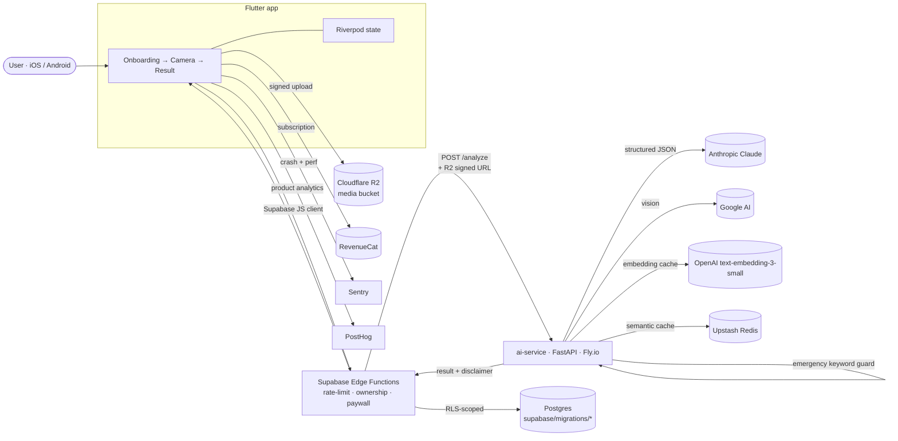

# PawDoc

> AI-native pet health triage. Photo, video, or text → instant guidance: **EMERGENCY**, **MONITOR**, or **LIKELY NORMAL**.

PawDoc is a multi-tier monorepo: a Flutter mobile app, a Supabase backend (Postgres + Auth + Storage + Edge Functions), a Python FastAPI AI orchestration service deployed on Fly.io, and Cloudflare R2 for media uploads.

The complete product strategy, architecture, and phase plan live in [`roadmaps/APP_EXECUTION_ROADMAP.md`](roadmaps/APP_EXECUTION_ROADMAP.md). That document is the source of truth — this README is the on-ramp.

---

## Architecture



The mobile app never talks to AI providers directly — every analysis flows through Supabase Edge Functions which enforce auth, rate limits, free-tier quotas, and ownership before forwarding to the AI service. The AI service runs an **emergency keyword guard before any model call** so genuinely urgent cases bypass the paid analysis path entirely.

---

## Repository Layout

```
pawdoc/
├── mobile/              Flutter 3.41 app (iOS + Android)
│   ├── lib/             Riverpod state, go_router routing, UI
│   ├── android/ ios/    Native shells
│   ├── supabase/        Mobile-side migration linkage
│   └── env/             dev.json / prod.json (gitignored, see *.example)
├── ai-service/          Python 3.12 FastAPI orchestrator (Fly.io)
│   ├── app/
│   │   ├── main.py      ASGI entry
│   │   ├── core/        settings, logging, errors
│   │   ├── routers/     /health, /analyze (Phase 1+)
│   │   ├── services/    AI providers, cache, emergency guard
│   │   ├── models/      pydantic request/response schemas
│   │   └── prompts/     system prompts + JSON contracts
│   ├── Dockerfile       Multi-stage uv-based build
│   ├── fly.toml         Fly.io deployment manifest
│   └── pyproject.toml
├── supabase/            Postgres + Edge Functions (Deno/TypeScript)
│   ├── migrations/      DDL · RLS policies · functions
│   ├── functions/       Edge Functions (Deno)
│   ├── config.toml      Local stack config
│   └── seed.sql
├── docs/                Architecture, dev, deploy, CI/CD, per-phase reports
├── .github/             CI/CD workflows
├── roadmaps/            Authoritative product + technical roadmap
├── reports/             Strategy analysis (market, growth, monetization, risk)
├── docker-compose.yml   Local AI service container
└── Makefile             One-command workflows
```

---

## Stack

| Layer | Choice |
|---|---|
| Mobile | Flutter 3.41 · Dart 3.11 · Riverpod 2.6 · go_router 14 · supabase_flutter 2.8 · image_picker · flutter_image_compress · connectivity_plus |
| Mobile observability | Sentry · PostHog · RevenueCat |
| Backend (BFF) | Supabase Edge Functions — Deno/TypeScript, rate-limit + ownership + paywall enforcement |
| Database | Postgres (Supabase managed) with RLS on every table |
| Storage | Cloudflare R2 (signed-URL uploads) |
| AI service | FastAPI 0.115 · Pydantic v2 · uvicorn · structlog · httpx · sentry-sdk |
| AI providers | Anthropic Claude (text + reasoning) · Google AI (vision) · OpenAI `text-embedding-3-small` (semantic cache only) |
| Cache | Upstash Redis (semantic cache for analysis results) |
| Build | Python 3.12, [uv](https://docs.astral.sh/uv/) for deps, Docker multi-stage |
| AI service hosting | Fly.io |
| Secrets | Doppler — never committed |
| CI/CD | GitHub Actions |

---

## Current Status

| Phase | Description | Status |
|---|---|---|
| 0 | Foundation & infrastructure | **In progress** — scaffold and CI/CD only |
| 1 | MVP core: camera → AI → result + auth + paywall | Pending |
| 2 | App Store launch | Pending |
| 3+ | Growth & scale | Pending |

See [`docs/reports/phase0-foundation-plan.md`](docs/reports/phase0-foundation-plan.md) for the active scope.

---

## Quick Start

Prerequisites:

- Flutter 3.41+ (`flutter --version`)
- Python 3.12 (`python3 --version`)
- [uv](https://docs.astral.sh/uv/) (Python package manager)
- Docker + Docker Compose v2.24+
- [Supabase CLI](https://supabase.com/docs/guides/cli)
- Git

```bash
git clone <repo-url> pawdoc && cd pawdoc

make setup            # bootstrap all services
make ai-dev           # FastAPI on :8080
make mobile-dev       # Flutter app on the connected device
make supabase-up      # local Postgres + Auth + Storage + Studio
```

Detailed setup: [`docs/local-development.md`](docs/local-development.md).

### AI service in Docker

The compose file ships with safe defaults so the service boots without secrets:

```bash
docker compose up ai-service     # http://localhost:8080
```

Real provider keys come from `ai-service/.env` (sourced via `env_file: required: false`) or Doppler.

---

## Make Targets

```
make help              List all targets
make setup             Bootstrap services for first run
make lint              Run linters across all services
make test              Run tests across all services
make format            Auto-format all code
make ai-dev            Start AI service (uvicorn --reload)
make mobile-dev        Run Flutter app on connected device
make supabase-up       Start local Supabase stack
make supabase-down     Stop local Supabase stack
make clean             Remove generated artifacts
```

---

## Core Principles (Non-Negotiable)

Lifted from the roadmap and the risk analysis. They hold from day one:

1. **Server-side validation of everything.** Free-tier limits, rate limits, ownership checks — never trust the client.
2. **RLS on every table.** Application-level bugs cannot leak cross-user data.
3. **Emergency override runs BEFORE any AI call.** Hardcoded keyword detection in `ai-service`.
4. **Disclaimer injected at API level.** UI changes cannot remove it.
5. **EMERGENCY analyses are NEVER paywalled.** Both unethical and trust-destroying.
6. **Structured JSON output from every AI call.** Free-text responses are rejected.
7. **Secrets via Doppler.** Never hardcoded, never in version control.

---

## Operational Notes

- **AI service container.** Multi-stage `Dockerfile` builds with `uv`, runs as non-root `app`, uses `tini` for clean shutdown, healthcheck on `/health`.
- **Local-only orchestration.** `docker-compose.yml` only models the AI service; Supabase has its own local stack started by `supabase start` to avoid duplication.
- **Mobile env files.** `mobile/env/dev.json` and `mobile/env/prod.json` are gitignored — see the `.example` siblings.
- **Phase 0 dependency surface is deliberately tight** (`fastapi`, `uvicorn`, `pydantic`, `httpx`, `structlog`, `sentry-sdk`). Feature-specific packages (RevenueCat, image, video) land in Phase 1 alongside the code that uses them.

---

## Documentation

- [`docs/architecture.md`](docs/architecture.md) — System architecture
- [`docs/local-development.md`](docs/local-development.md) — Laptop setup
- [`docs/environment-setup.md`](docs/environment-setup.md) — Cloud account runbook
- [`docs/deployment.md`](docs/deployment.md) — Release pipelines
- [`docs/ci-cd.md`](docs/ci-cd.md) — GitHub Actions workflows

---

## License

Proprietary. All rights reserved. © PawDoc 2026.
